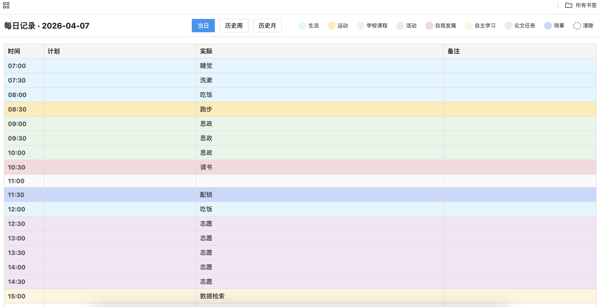
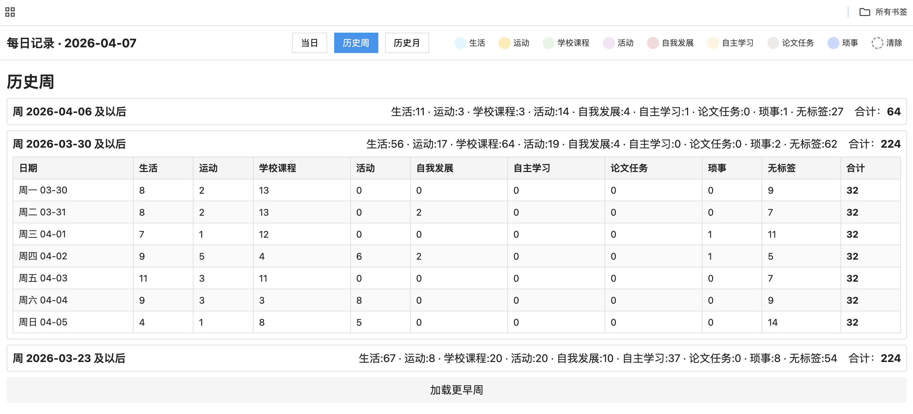
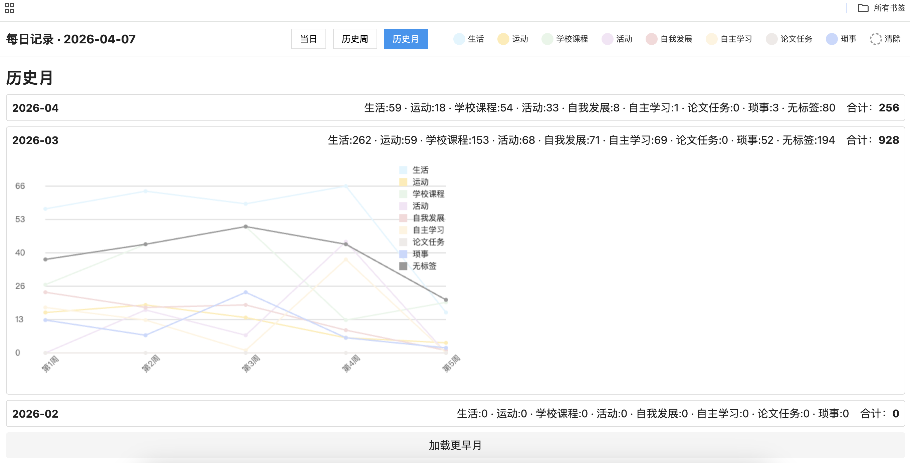

# TimeTrack_AuditYourPlan

&gt; 记录真实的时间开销，让计划更靠谱。

一个基于浏览器的时间日志工具，每 30 分钟一格，记录计划、实际执行和备注，支持分类标签与周/月统计复盘。

## 预览

*当日记录：7:00-23:00 时间格，带标签高亮*

*历史周：各分类时间趋势折线图*

*历史月：各分类时间趋势折线图*

---

## 功能

| 模块 | 说明 |
|:---|:---|
| **当日记录** | 7:00-23:00，每 30 分钟一行；可填计划、实际、备注；8 种颜色标签快速标记 |
| **标签系统** | 生活 / 运动 / 学校课程 / 活动 / 自我发展 / 自主学习 / 论文任务 / 琐事 |
| **历史周** | 按周汇总，展开看每日细分，支持加载更早周 |
| **历史月** | 按月汇总，可视化折线图展示每周各标签趋势 |
| **自动保存** | 数据存于 LocalStorage，关闭页面不丢失；跨天时自动切换新表 |
| **实时统计** | 当日/周/月各标签时段数即时统计 |

---

## 快速开始

1. 下载 `index.html`
2. 用浏览器打开即可使用（无需安装、无需联网）

---

## 使用场景

- **学生**：追踪课程、自习、科研时间的真实分配
- **自由职业者**：复盘时间黑洞，优化报价和排期
- **习惯养成**：对比"计划 vs 实际"，逐步校准时间预估能力

---

## 技术

- 纯前端：HTML + CSS + JavaScript
- 零依赖，单文件
- 数据本地存储（LocalStorage）

---

## 待办 / 可能的方向

- [ ] 实现跨天不关电脑自动更新
- [ ] 数据导出（JSON / CSV）
- [ ] 自定义时间段（目前固定 7-23 点）
- [ ] 自定义分类标签及颜色
- [ ] 多设备同步方案
- [ ] 暗黑模式

---

## License

MIT
